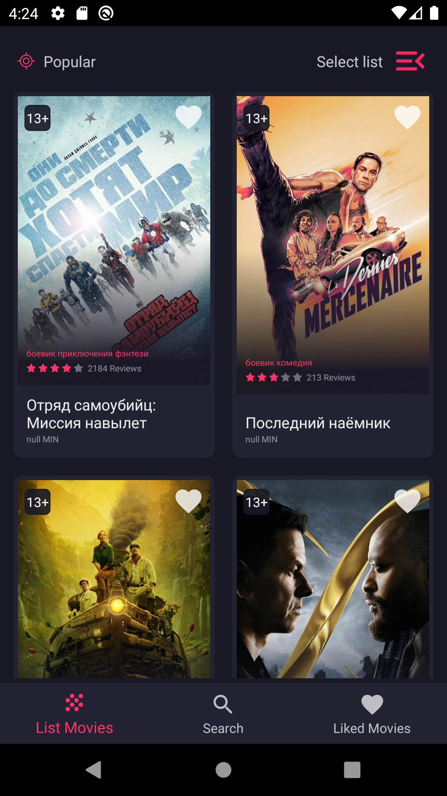
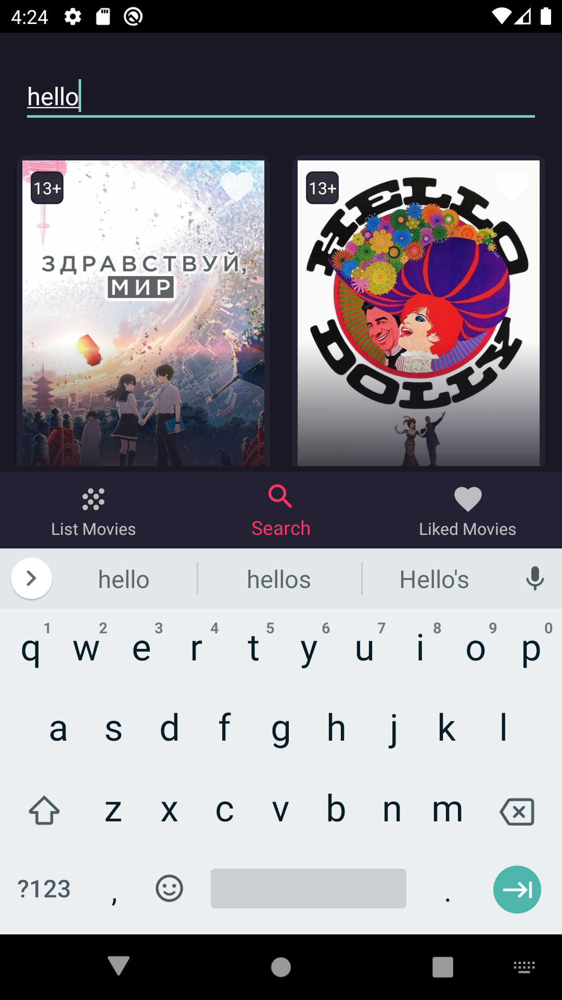
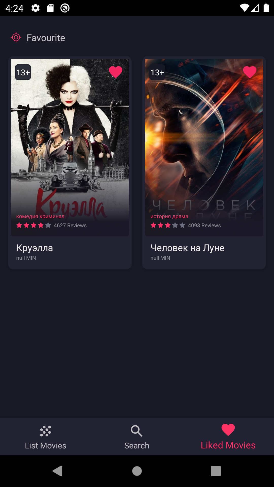

# Android Fundamental test project

## Partly rewritten in Compose

Educational application, based on [public TMDB API](https://www.themoviedb.org/) as a data source.

## Technology stack:

* Kotlin
* Coroutines + Flow
* Single activity + Fragments/No fragments in Compose
* Dagger 2
* MVVM (ViewModel+LiveData)
* Retrofit2 (TMDB API) + Room
* Navigation Component / Custom navigation in Compose
* Paging / Paging-Compose
* Glide / Coil-Compose

## Screenshots

  

  

  

  

  

